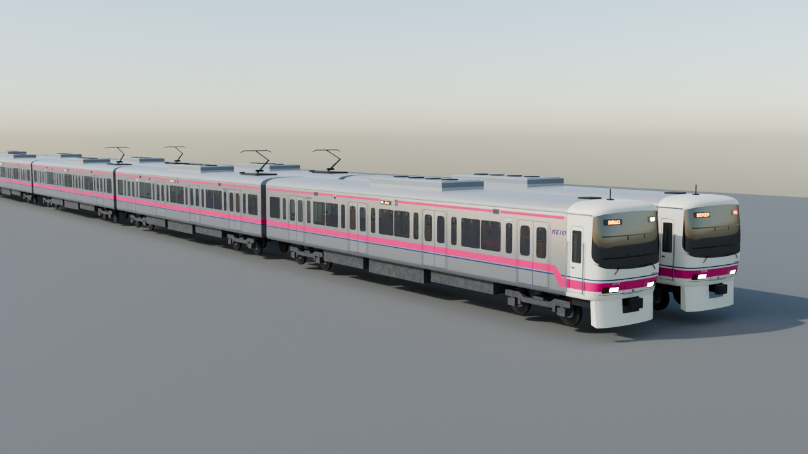

# 京王8000系 3Dモデル（Blender 4.2）

京王8000系（大規模改修後の外観）の Blender 用モデルです。動画「京王線高架化」で使った車体（v4）を、単体で使えるようにしました。



- 寸法・帯・窓・扉・前面の部品は、編成写真の画素から測った値です（ref/keio8000_measured_v4.md）
- 10両（8714F・8713F）と8両（8728F）の編成、種別・行先・車番の表示、灯火、乗客（空いている／満員）
- 曲線・勾配の線路に1両ずつ沿わせて走らせられます（examples/along_curve.py）

## すぐ使う

```python
import sys, math
sys.path.insert(0, "/path/to/keio8000_model")
import keio8000 as k8
k8.init()
tr = k8.build_train("下り特急", "8714F", kind="特急", dest="京王八王子", bound="down")
k8.place_straight(tr, front=(0, 0, 0), heading=math.pi)
```

Blender の画面で使うだけなら、`keio8000.blend` から編成のコレクションをアペンドしてください。

## 必要なもの

- Blender 4.2（`pip install bpy==4.2.0`、Python 3.11）または Blender 4.2 本体
- 照合のスクリプトには numpy と pillow

詳しい使い方・座標の約束・作業ルール・確かでない点は **CLAUDE.md** にあります。

## ライセンスまわり

- 同梱フォント（keio8000/fonts/）は Noto Sans CJK JP Bold の部分集合です（SIL Open Font License 1.1、OFL.txt）
- ref/ftex.png は 3d-keio の前面写真です。公開するときは写真の権利を確かめてください
